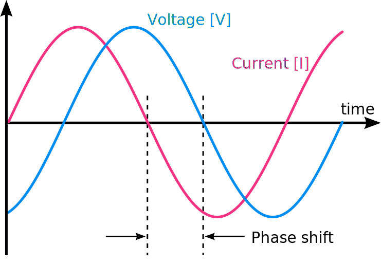

<!-- .slide: id="problem" data-state="white_overlay yellow_flag logo" data-background="./files/wires-7997980_1280.jpg" -->
<!-- https://pixabay.com/photos/wires-electrical-current-electricity-7997980/ -->
# Problem

---

<!-- .slide: data-state="white_overlay 9 yellow_flag logo" data-background="./files/wires-7997980_1280.jpg" -->
## Power Grid Simulation

Your colleague Sam has written a simulation of a power grid:

- Circular architecture of identical <b>Lines</b>
- One <b>Generator</b>
- Two loads: <b>Datacenter</b> and <b>Factory</b>

They want to analyze how changing reactive power of the load <b>Factory</b> changes the reactive load angles of the lines.

---

<!-- .slide: data-state="white_overlay 9 yellow_flag logo" data-background="./files/wires-7997980_1280.jpg" -->
## Flashback: Physics

Adapted, from [commons.wikimedia.org/wiki/File:Phase_shift.svg](https://commons.wikimedia.org/wiki/File:Phase_shift.svg) under [CC BY-SA 3.0 Deed](https://creativecommons.org/licenses/by-sa/3.0/deed.en)

---

<!-- .slide: data-state="white_overlay 9 yellow_flag logo" data-background="./files/wires-7997980_1280.jpg" -->
## Problem

Sam's code does not scale well. There might be bugs. They know you have been following the ESI-far workshop and ask you to refactor their code.
