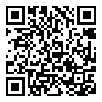

<!-- .slide: data-state="standard" data-background="./files/icon-1480926_1280.png" -->
<!-- https://pixabay.com/illustrations/icon-wifi-network-wifi-icon-1480926/ -->
## WiFi

  
network: abc 
password: def 
TODO replace
  

---

<!-- .slide: data-state="standard 7" data-background="./files/hands-2847508_1280.jpg" -->
<!-- https://pixabay.com/photos/hands-friendship-friends-children-2847508/ -->
## Code of Conduct

- Use welcoming and inclusive language
- Be respectful of different viewpoints and experiences
- Gracefully accept constructive criticism
- Focus on what is best for the community
- Show courtesy and respect towards other community members

---

<!-- .slide: data-state="standard" data-background="./files/flipchart-3614771_1280.png" -->
<!-- https://pixabay.com/vectors/flipchart-projector-canvas-graphic-3614771/ -->
## Slides

<a href="https://esi-far.github.io/workshop_2024_slides/">esi-far.github.io/workshop_2024_slides</a>

